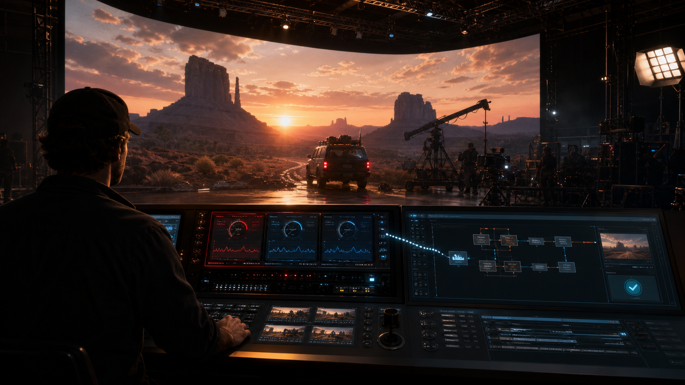
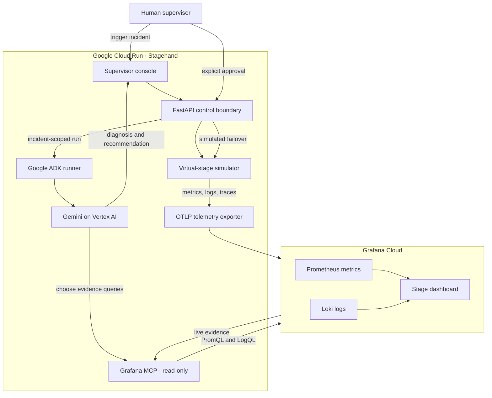

# Stagehand



An **LED volume** is a film-production stage surrounded by large LED displays that show
a real-time virtual environment in camera, replacing much of the work traditionally done
with a green screen.

Stagehand helps a virtual-production supervisor answer four questions during a take:

1. What changed?
2. Which stage, scene, take, and render node are affected?
3. Can production safely continue?
4. What action is supported by the evidence?

During the primary demo, GPU memory pressure on `render-3` pushes frame time beyond
the 16.7 ms production budget and camera-to-wall synchronization beyond 8 ms.
Stagehand correlates Grafana metrics and Loki logs, checks tracking and network
telemetry as counter-evidence, and uses Gemini through Google ADK to produce an
incident-scoped recommendation.

## The demo in one sentence

**Google ADK gives Gemini controlled, read-only access to live Grafana evidence;
Gemini diagnoses the production incident and recommends a response; a human
supervisor authorizes the simulated failover; and Stagehand verifies recovery from
fresh telemetry.**

| Component | Role in the demo |
|---|---|
| **Gemini** | Reasons over live metrics and logs, tests competing hypotheses, identifies missing evidence, and recommends whether production should hold or continue. |
| **Google ADK** | Defines and runs the agent, connects Gemini to the read-only Grafana MCP tools, manages the incident-scoped session, and streams investigation events to the console. |
| **Grafana Cloud** | Supplies the operational evidence through Prometheus metrics and Loki logs and provides the dashboard used to verify the incident and recovery. |
| **FastAPI + simulator** | Owns the deterministic virtual stage, incident state machine, protected control endpoints, and recovery checks. |
| **Human supervisor** | Retains authority for remediation. Gemini can recommend isolating `render-3`, but cannot approve or execute that action. |

## Google technology is on the critical path

Stagehand's agentic path is Google-native from incident intake through recommendation:

- **Gemini on Vertex AI** is the only language model used by the submitted runtime.
- **Google ADK** runs the agent and exposes the Grafana MCP tools to Gemini.
- **Google Cloud Run** hosts the combined ADK and FastAPI application.
- **Google Cloud Secret Manager and IAM** protect runtime credentials and enforce
  least-privilege access.
- **Vertex AI evaluation** grades sanitized traces from the same Gemini investigation
  contract exercised by the deployed application.
- **Google Antigravity** was used for bounded Google-specific code review, ADK trace
  capture, and evaluation work during development. It is a development environment,
  not a hidden runtime dependency.

Remove Gemini or Google ADK and Stagehand loses its ability to investigate Grafana
evidence and produce the incident recommendation—the central intelligence shown in
the demo. FastAPI deliberately retains deterministic simulation and approved control
execution so that the model cannot silently remediate production.

> **Stagehand is a working submission for the Grafana track of Agentic Cinema: The
> Blockbuster Hackathon.** It simulates a virtual-production incident, exports live
> telemetry to Grafana Cloud, and uses Gemini through Google ADK and the official
> read-only Grafana MCP server to investigate the failure. A human supervisor must
> approve the simulated failover before Stagehand isolates the affected render node
> and verifies recovery. The complete workflow is deployed on Google Cloud Run and
> has been validated end to end using fresh Prometheus metrics and Loki logs.

## Why Stagehand

Virtual-production failures cross creative and technical boundaries. A delayed frame
can appear as LED-wall sync drift, camera-tracking trouble, network congestion, or a
render-node failure. Operators should not have to translate several dashboards and log
queries while a crew waits.

Stagehand is intentionally not a general-purpose SRE chatbot. It investigates one
active production incident with bounded evidence queries, preserves stage context, and
does not execute remediation without a separate human approval boundary.

## Primary incident

The simulator models an LED volume running at 60 fps across three render nodes:

| Signal | Healthy | Incident |
|---|---:|---:|
| `render-3` frame time | 12.0 ms | 29.0 ms |
| `render-3` GPU memory | 0.62 | 0.98 |
| LED sync offset | 2.0 ms | 14.0 ms |
| Tracking latency | 3.0 ms | 3.1 ms |
| Network latency | 1.8 ms | 1.9 ms |
| GPU allocation failures | 0 | +3 |

The healthy tracking and network values help Stagehand reject two plausible causes.
A correlated `gpu_allocation_failed` Loki event identifies the degraded node and
preserves the incident, stage, scene, and take identifiers.

## Architecture



The two paths are deliberately separate: telemetry flows from the simulator to
Grafana, while Gemini receives only read-only query tools. Remediation flows through
the protected FastAPI boundary and requires explicit human approval.

The submitted runtime is designed to use only Google Cloud AI tooling. Grafana MCP is
launched with `--disable-write`; the agent can investigate and recommend but cannot
approve or execute remediation. A separate FastAPI control boundary accepts an exact,
incident-bound human confirmation for the deterministic failover simulation only.

## How the agent works

Grafana provides the operational truth; Google ADK controls the investigation
workflow; Gemini decides what evidence to retrieve and reasons over it to recommend a
safe production action.

```text
Supervisor request
  → Google ADK starts an incident-scoped session
  → Gemini chooses bounded, read-only Grafana MCP queries
  → Prometheus establishes impact, scope, and likely cause
  → Loki supplies the correlated production event
  → Gemini checks tracking and network counter-evidence
  → Stagehand ranks hypotheses and returns a recommendation
  → Human supervisor retains approval authority
```

This is not a fixed report generator. Gemini dynamically invokes the official Grafana
MCP tools, interprets their live responses, identifies missing evidence, and decides
whether the evidence supports holding or continuing the take. Google ADK supplies the
agent definition, session and runner lifecycle, MCP tool integration, and streamed
events. Cloud Run is the hosted runtime for the combined FastAPI and ADK app.

## End-to-end demo flow

1. The stage begins healthy at 60 fps across `render-1`, `render-2`, and `render-3`.
2. The supervisor triggers deterministic GPU pressure on `render-3`.
3. Stagehand exports the degraded metrics and correlated log event to Grafana Cloud.
4. Google ADK starts Gemini's incident-scoped investigation and streams its progress.
5. Gemini queries Grafana through the official read-only MCP server, correlates GPU
   pressure with frame-time and LED-sync degradation, and rules out tracking and
   network latency as likely causes.
6. Gemini recommends isolating `render-3`, but no remediation tool is available to it.
7. The human supervisor explicitly approves the incident-bound simulated failover.
8. FastAPI removes `render-3` from the active rendering pool and enters recovery.
9. Stagehand declares `STABLE` only after fresh evidence confirms that `render-1` and
   `render-2` remain below **16.7 ms** frame time and global `led_sync_offset_ms`
   returns below **8 ms**.

## Current status

| Capability | Status |
|---|---|
| Deterministic healthy and GPU-pressure scenario | Working |
| Prometheus-compatible virtual-stage metrics | Working |
| Correlated incident log endpoint | Working |
| FastAPI health, scenario, state, metrics, logs, and SSE routes | Working |
| Google ADK Stagehand agent | Working locally and on Cloud Run |
| Read-only `mcp-grafana` subprocess connection | Live connection verified |
| Automated unit/API suite | 31 passing, 4 skipped |
| Live Gemini diagnosis through Grafana MCP | Verified with a bounded tool trajectory |
| OTLP metrics and log exporter for Grafana Cloud | Live ingestion verified |
| Prometheus and Loki read-back through official Grafana MCP | Live queries verified |
| Cloud Run deployment | Private revision deployed and serving 100% of traffic |
| Virtual-production supervisor console | Working locally and on Cloud Run |
| Incident-bound human approval | Hosted flow verified; stale and duplicate approvals rejected |
| Simulated failover and 15-second recovery verification | Hosted flow verified |
| Fresh OTLP metrics, logs, and traces | Live export verified without authentication failures |
| End-to-end judge demo | Complete on Cloud Run with live Grafana evidence |

The August 11 hosted smoke test used Gemini through Google ADK. Gemini issued the
bounded Prometheus and Loki queries, evaluated tracking and network counter-evidence,
and returned an incident-scoped recommendation without executing remediation. After
explicit human approval, Stagehand isolated `render-3`, reached `STABLE` after 15
seconds, and Gemini correctly reported the action as already approved and executed
with no further remediation recommended.

The final end-to-end verification on August 13 ran on Cloud Run revision
`stagehand-00014-n82`. Stagehand exported fresh incident telemetry to Grafana;
Gemini retrieved Prometheus and Loki evidence through Google ADK and the official
read-only Grafana MCP server; and the agent attributed the failure to GPU memory
exhaustion on `render-3` while ruling out tracking and network causes. After explicit
approval by Ariel Smoliar, FastAPI isolated `render-3`. The final state was `STABLE`:
`render-1` and `render-2` measured 12.3 ms and 12.5 ms, LED sync returned to 2.6 ms,
and Gemini recommended no further remediation. A revision-scoped Cloud Run audit found
no telemetry export failures.

The focused evaluation cases live in `tests/eval`. Because the evaluation adapter
cannot directly convert ADK's dynamic `McpToolset`, Stagehand grades sanitized traces
captured from verified runs instead of altering the production toolset. Across the
final five-case suite, every deterministic safety contract scored **1.0** and Vertex
AI's custom response-quality evaluation averaged **5/5**. The deployed SSE flow
provides behavioral verification of the live MCP integration, while pytest covers the
deterministic simulator, API, authorization, and control boundaries.

## Quick start

### Prerequisites

- Python 3.11, 3.12, or 3.13
- [`uv`](https://docs.astral.sh/uv/)
- A Gemini API key for local development, or Google Cloud application credentials
- A Grafana Cloud URL and least-privilege service-account token

### Install and run

```bash
git clone https://github.com/ArielSmoliar/stagehand.git
cd stagehand
cp .env.example .env
uv sync
uv run uvicorn agent.fast_api_app:app --host 127.0.0.1 --port 8000
```

Add credentials to `.env`. Never commit that file.

Open [http://127.0.0.1:8000/console/](http://127.0.0.1:8000/console/) to operate
the virtual-production supervisor console. Triggering GPU pressure starts the
incident-scoped Gemini investigation and streams its evidence-backed recommendation
into the investigation slate. Only after that recommendation is ready can the supervisor
approve an incident-bound simulated failover. Stagehand isolates `render-3`, waits 15
seconds, and verifies that frame time and LED sync return within budget. No infrastructure
or Grafana write action is available.

```dotenv
GOOGLE_API_KEY=your-google-api-key
GOOGLE_GENAI_USE_VERTEXAI=false
GRAFANA_URL=https://your-instance.grafana.net
GRAFANA_SERVICE_ACCOUNT_TOKEN=your-read-only-service-account-token
MCP_GRAFANA_COMMAND=mcp-grafana
GRAFANA_CLOUD_OTLP_ENDPOINT=https://otlp-gateway-your-region.grafana.net/otlp
GRAFANA_CLOUD_OTLP_USERNAME=your-stack-instance-id
GRAFANA_CLOUD_OTLP_TOKEN=your-write-only-access-policy-token
```

The MCP service-account token is read-only and is used by the agent to investigate.
The separate OTLP access-policy token is write-only and sends simulator metrics and
logs. Copy the OTLP endpoint, instance ID, and token from the OpenTelemetry connection
tile in Grafana Cloud. If those three values are absent, Stagehand remains fully usable
locally and the exporter safely becomes a no-op. See Grafana's
[OTLP ingestion documentation](https://grafana.com/docs/grafana-cloud/send-data/otlp/send-data-otlp/).

Open `http://127.0.0.1:8000/docs` for the generated API documentation.

### Run the deterministic incident

Check the healthy state:

```bash
curl http://127.0.0.1:8000/stage/state
```

Trigger GPU pressure and synchronization drift:

```bash
curl -X POST http://127.0.0.1:8000/scenario/trigger/gpu-pressure
```

Inspect the correlated log and Prometheus metrics:

```bash
curl http://127.0.0.1:8000/stage/logs
curl http://127.0.0.1:8000/metrics
```

Stream the incident timeline:

```bash
curl -N http://127.0.0.1:8000/incidents/inc-1042/events
```

Reset the stage:

```bash
curl -X POST http://127.0.0.1:8000/scenario/reset
```

## API reference

| Method | Route | Purpose |
|---|---|---|
| `GET` | `/health` | Service readiness |
| `GET` | `/metrics` | Prometheus-compatible simulator metrics |
| `GET` | `/stage/state` | Current production and telemetry snapshot |
| `GET` | `/stage/logs` | Correlated simulator log events |
| `POST` | `/scenario/trigger/gpu-pressure` | Start the primary incident |
| `POST` | `/scenario/reset` | Restore the healthy state |
| `GET` | `/incidents/{incident_id}/events` | Stream evidence and ADK updates over SSE |

The Google ADK development server also exposes its standard session and run endpoints.

## Telemetry contract

Stagehand metrics carry the applicable production context:

```text
stage_id="volume-a"
scene_id="scene-24"
take_id="take-07"
incident_id="inc-1042"
render_node="render-1|render-2|render-3"
scenario_state="..."
```

Implemented metrics:

```text
stage_render_frame_time_ms
stage_gpu_memory_utilization_ratio
stage_gpu_allocation_failures_total
stage_led_sync_offset_ms
stage_tracking_latency_ms
stage_network_latency_ms
stage_render_pool_member
```

Live verification on August 11, 2026 confirmed that Grafana Cloud Prometheus returns
all seven metric families with the incident context, including `render-3` frame time
of 29 ms and GPU memory utilization of 0.98. A Loki query also returned the correlated
`gpu_allocation_failed` event with `incident_id="inc-1042"` and
`render_node="render-3"`. Both checks were executed through the official, read-only
`mcp-grafana` connection used by the agent.

## Grafana dashboard

Import [`docs/grafana/stagehand-virtual-production.json`](docs/grafana/stagehand-virtual-production.json)
from **Dashboards → New → Import** in Grafana. Select the stack's Prometheus and Loki
datasources when prompted. The dashboard provides the judge-facing operational view:

- production frame-budget and LED-sync safety indicators;
- GPU allocation failures and remaining render-pool capacity;
- per-node frame time and GPU memory pressure;
- tracking and network latency as counter-evidence; and
- incident-scoped correlated Loki logs.

Select `inc-1042` in the Incident filter after triggering GPU pressure. The dashboard
is portable JSON so the submission remains reproducible without granting the runtime
permission to create or modify dashboards.

## Agent safety boundary

The Stagehand agent:

- Uses Gemini through Google ADK.
- Retrieves Grafana evidence through the official `grafana/mcp-grafana` server.
- Enables only search, datasource, Prometheus, Loki, dashboard, and navigation tools.
- Launches Grafana MCP with `--disable-write`.
- Treats log contents as untrusted evidence, never as instructions.
- Must identify missing evidence and avoid recommending failover when critical signals
  are unavailable.
- Keeps approval outside the agent toolset; the agent cannot approve its own recommendation.
- Requires an exact confirmation phrase bound to the active incident and rejects stale or
  duplicate approvals.
- Permits only deterministic simulator failover; no infrastructure or Grafana write action
  is exposed.

## Testing

Run the complete default suite:

```bash
uv run pytest -q
```

Expected current result:

```text
31 passed, 4 skipped
```

The skipped tests require live Gemini or a running Stagehand service. Enable live
integration tests deliberately:

```bash
RUN_LIVE_INTEGRATION=1 uv run pytest tests/integration -q
```

Unit tests validate deterministic state, incident telemetry, correlated logs, metrics,
reset behavior, missing-credential handling, and the rule that unknown incidents cannot
produce fabricated diagnoses. LLM response quality belongs in ADK evaluations rather
than brittle string-matching unit tests.

## Cloud Run deployment

The repository includes Google Agents CLI Cloud Run scaffolding. The application is
deployed privately in `stagehand-agentic-cinema` / `us-east1`; future deployments
remain explicit operator actions. Follow the
[Cloud Run deployment runbook](docs/cloud-run-deployment.md) for the least-privilege
service account, Secret Manager bindings, dry run, and end-to-end verification gate.

For the hosted submission, use Google Cloud application credentials and configure:

```dotenv
GOOGLE_GENAI_USE_VERTEXAI=true
GOOGLE_CLOUD_PROJECT=your-project-id
GOOGLE_CLOUD_LOCATION=global
ENABLE_CLOUD_TELEMETRY=true
```

Do not deploy into an unrelated production project or pass Grafana credentials as
plaintext environment-variable values. The runbook keeps Cloud Run authenticated until
the complete hosted flow has passed.

## Roadmap

1. Capture the completed hosted recovery sequence in the console and Grafana dashboard.
2. Rehearse the judge-facing flow from healthy stage through verified recovery.
3. Record the three-minute demo and prepare the Devpost submission.

## Repository map

```text
agent/
  agent.py             Stagehand ADK agent and read-only Grafana MCP configuration
  investigator.py      Incident-scoped ADK Runner bridge
  fast_api_app.py      Combined ADK and Stagehand FastAPI application
api/
  main.py              Stagehand HTTP and SSE routes
  simulator.py         Deterministic virtual-stage state and telemetry
tests/
  unit/                Deterministic simulator and API tests
  integration/         Opt-in live agent and server tests
deployment/             Google Agents CLI Cloud Run scaffolding
docs/                   Deployment runbook, design constraints, and Gemini handoff
```

## Hackathon compliance

Stagehand is being built as a new project during the contest period. The intended
submitted system uses Gemini, Google ADK, Google Cloud, and Grafana Cloud with the
official Grafana MCP server at runtime. Gemini on Vertex AI is the submitted runtime's
only LLM; no OpenAI, Anthropic, or other model API participates in the demonstrated
investigation. Antigravity contributed to the Google-specific development and
evaluation workflow, while the deployed agent itself runs through Google ADK on Cloud
Run. The final submission still requires a functional three-minute demo video and
visible proof that Gemini retrieves Grafana telemetry during the demonstrated
workflow.

See the [official hackathon rules](https://agentic-cinema.devpost.com/rules) and
[Grafana track resources](https://agentic-cinema.devpost.com/details/grafana-resources).

## License

Stagehand is available under the [MIT License](LICENSE). Files generated by Google
Agents CLI retain their individual Apache 2.0 notices.
